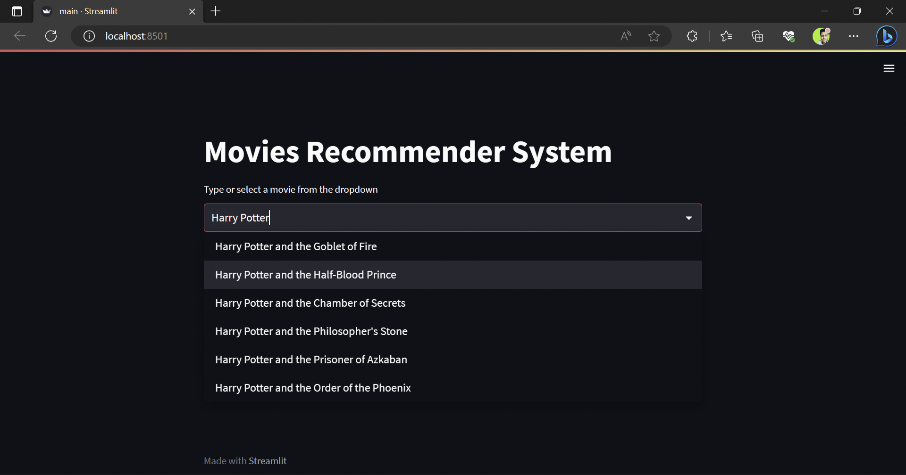

# Content Based Movie Recommendation System Using Cosine Similarity

<!-- Description -->
A content based Movie Recommendation system using cosine similarity, when the user search for a movie will get top5 recommendations based on the same movie of similar genre. It is implemented in two major steps.

**Data Preprocessing**:  
the dataset was big and contained irrelevant columns So that's why we needed to keep relevant columns were movie_id, title, overview, genres, keywords, cast and crew. Then we merged columns like (overview, genres, keywords, cast and crew) and formed a new column named “tags” and then removed stop words from tags by applying stemming using NLTK.  
**Text Vectorization**: 
To recommend movies with similar content, we need to apply the cosine similarity method, which we can only apply to numerical representations. Thus, we converted tags into a numerical representation(vectors) using the method Countvectorizer. Finally, a function named "Submit" was created to recommend top5 movies based on the similarity found after measuring with the help of cosine similarity. 

## Demo
<!--  -->

## Some Recommendations
<!--  -->

## How to get the API key?
Create an account in https://www.themoviedb.org/, click on the `API` link from the left hand sidebar in your account settings and fill all the details to apply for API key. If you are asked for the website URL, just give "NA" if you don't have one. You will see the API key in your `API` sidebar once your request is approved.

## Similarity Score:
How does it decide which movies are most similar to the movie user search? Here comes the similarity scores.

It is a numerical value ranges between zero to one which helps to determine how much two items are similar to each other on a scale of zero to one. This similarity score is measuring the similarity between the text details of movie which is user search for and rest of all movies. So, similarity score is the measure of similarity between given text details of two movies. This can be done by `Cosine Similarity`.

## How does Cosine Similarity work?
Cosine similarity is a metric used to measure how similar the texts are irrespective of their size. Mathematically, it measures the cosine of the angle between two vectors projected in a multi-dimensional space. The cosine similarity is mostly prefered because even if the two similar texts are far apart by the Euclidean distance(due to the size of the text), chances are they might be oriented much close to each other. The smaller the angle, higher the cosine similarity.

## Source of the Dataset:
[IMDB 5000 Movie Dataset](https://www.kaggle.com/datasets/tmdb/tmdb-movie-metadata?select=tmdb_5000_movies.csv)